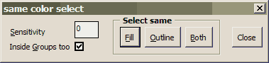
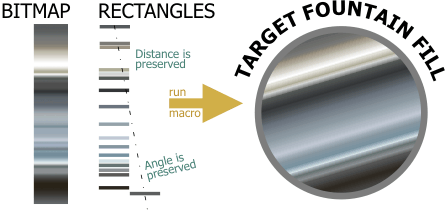
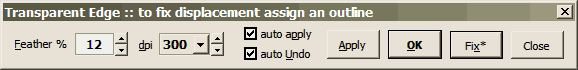

# wOxxOm's Tools

## Некоторые функции

*Автор данного текста неизвестен, оставлю пока как есть*

- PClipPick — выбор объекта внутри поверклипа без вхождения в режим его редактирования, под указателем мыши. Работает только при назначении макросу горячей клавиши, например: назначьте две, "W" и "Shift-W" (с Shift для того чтобы выбирать несколько внутри поверклипа). Если выбран поверклип внутри поверклипа то повторный вызов макроса будет выбирать уже в этом вложенном.

- ZoomOutBack — (для DrawX3) назначьте на F3, восстанавливает правильное (до Х3) поведение этой клавиши (переход к последнему масштабу зума, что удобно при возврате после экстремального увеличения масштаба)

- ZoomFullPage — назначьте на Shift-F4, для замены стандатной функции показа всей страницы (5% вместо 20% пустого пространства вокруг страницы)

- ScrollScreen[Down, Up, Left, Right, DownRight, UpRight, DownLeft, UpLeft] — Перелистывание экрана на 80% по направлениям: Вниз, Вверх, Влево, Вправо, ВнизВправо, ВверхВправо, ВнизВлево, ВверхВлево. Удобно если назначить на клавиши Ctrl-Alt-Numpad (1..9, по направлению перемотки)

- InvertSelection — инверсия выделения

- SelectInside — usage: select a lot of small shapes, run the macro, click some big shape (not in Wireframe view)- all the objects inside the big one will be selected.

- SelectComplexCurves — для поиска кривых с числом узлов более заданного

- SelectSmallObjects — для поиска (и, если ответить Yes, удаления) мелких объектов, меньше чем заданный размер. Удобно для подчистки результатов трассировки

- SelectSame[...]

Выбор объектов с совпадающими с текущим объектом цветом заливки / заливки и обводки / обводки / интерактивный диалог (см. картинку). Удобно например назначить на клавиши: F, Ctrl-Shift-F, Shift-F. Выбираются только объекты вне групп. Для выбора так же и внутри групп (без разгруппировки!) макросами без диалога — включить индикатор ScrollLock, вызвать макрос и ввести отрицательное число. Кстати само по себе это число задает степень различия цвета для выбора.

- CreateFountain — быстрое и удобное создание многоцветовых градиентов. Создайте много простых разноцветных объектов (например прямоугольников), выделите их и запустите макрос, затем укажите фигуру для заливки градиентом. Угол воображаемой линии, проходящей через центры крайних исходных объектов, используется для градиента (см. картинку).
  
  *Подсказка*: для быстрого воссоздания градиента из цветов битмапа: создайте сколько нужно прямоугольничков, переключитесь на инструмент пипетка, установите вверху его режим в ColorSampler, а теперь нажимайте один раз на картинке и потом с Shift — на очередном прямоугольничке. Повторите сколько надо, затем запускайте макрос.
  
- ConvertShapesToCMYK — перевести объекты, в том числе битмапы, в CMYK (выбранное / весь документ). Используется активный цветовой профиль в Tools-\>Color Management
  
- TransparentEdge — прозрачный край для простых объектов (в т.ч. битмапов). Работает странно :-) потому, что используется нестандартный метод. Сбросить эффект рузмеется можно, выбрав, например, инструмент Transparency ("рюмка") и нажать там на кнопку сброса. 

- TextToCurves — текст в кривые в выбранном или всем документе, включая и поверклипы.

- OutlinesToQ_KillEmpty — перевод обводки в кривую с удалением исходной фигуры, если она без заливки и без обтекания текста / поверклипа / эффектов / меш

- OutlineBehind — обводка "под низом" (чтобы не заходить в диалог свойств обводки). Shift-клик (и Ctrl-клик) на кнопке вызова макроса — обычная обводка

- OutlineCorners — обводка со скругленными углами, Ctrl-клик: острыми, Shift-клик: срезанными

- OutlineIncrease & OutlineDecrease — увеличение / уменьшение толшины обводки без диалога для всех выделенных объектов относительно их исходной обводки в индивидуальном порядке. У меня назначено на Ctrl-Alt-СтрелкаВверх и Ctrl-Alt-СтрелкаВниз

- OutlineEqualsFill — сделать цвет обводки такой же как у заливки для выделенных объектов в индивидульном порядке. Очень полезно для устранения дефектов отображения результата трассировки в Х3 (призрачные белые обводки)

- GuideHorizontal, GuideVertical — создать направляющую горизонтальную / вертикальную в позиции указателя мыши. Только для вызова с клавиатуры (например, H и V)

- PasteAtMouse — вставка из буфера в позиции указателя мыши. Только для вызова с клавиатуры (например, Ctrl-Shift-V)

- ForEach — повторить последний простой трансформ объекта на множестве выделенных объектов индивидуально. "Простой" означает повторяемый через Ctrl-R. — исправлен баг с повторением вращения

- BlendSplit — (только в Х3) расщепить бленд в позиции указателя мыши. Только для вызова с клавиатуры. Для многосоставных (compound) бленд сначала надо выделять с Ctrl нужный сегмент. Помимо прочего удобства, макрос исправляет баг — слет угла созданного управляющего субобъекта на блендах по пути с автовращением

- SizePagetoFIT — сделать размер страницы равным размеру области объектов + заданный в окне зазор (числа округляются при нажатии OK с Shift или Shift-Enter)

- PageNamesAsNumbers — убрать названия страниц (удобно чтобы внизу экрана помещалось больше "ярлычков" страниц)

- DupOnNextPage — дублирование выделнных объектов на следующую страницу без использвания буфера. Слои не учитываются. Удобно в случае большого объема данных

- OverprintsRemove — Убрать все оверпринты, в т. ч. с битмапов (Х3) на выделенных объектах или во всем документе  

*Следущие три макроса для битмапов работают с выделенными объектами или всем документом, в т.ч. и внутри поверклипов. В конце выводят постраничную статистику*

- BitmapsDownsample — ресэмлировать картинки на выбранное dpi, если текущее dpi картинки превышает заданное более чем на 20%.

- BitmapsSetDPI — сменить dpi битмапов *без* ресэмплирования (меняется геометрический размер).

- BitmapsToPowerclips — поместить битмапы в прямоугольные поверклипы по размеру картинки. Можно указать зазор.

- BitmapsResizer — изменить геометрические размеры битмапов *без* ресэмплирования.
  В окне настройки можно указать размеры и опции (например, 100 0 ap):
  - сохранять пропорции — один из размеров равен 0, он и будет подстраиваться автоматически
  игнорировать пропорции — оба размера не нулевые
  - обрабатывать весь документ — указана английская буква A (от слова All) 
  - смотреть внутри поверклипов — указана английская буква P (от слова Powerclip)
